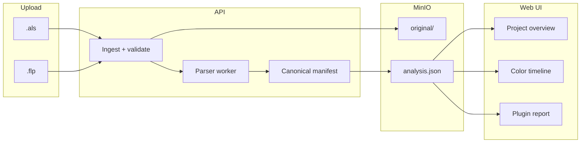

# DAW project management roadmap (Ableton Live + FL Studio)

Product roadmap for hosting, analyzing, and managing **Ableton** (`.als`) and **FL Studio** (`.flp`) projects inside Meshroom sessions. Complements the live collaboration MVP ([ROADMAP.md](./ROADMAP.md)).

**Status:** phases A–D implemented (API + session UI + E2E scaffold) · **Last updated:** 2026-05-17

---

## Goals

| Goal | Description |
|------|-------------|
| **Shared context** | Before/during a jam, everyone sees the same project map: tracks, plugins, colors, arrangement blocks. |
| **Plugin awareness** | Surface “you need X, Y, Z” so collaborators can match setups. |
| **Version history** | Re-uploads and session snapshots form an auditable project timeline. |
| **DAW parity** | One UX and API; Ableton and FL differ under the hood. |
| **No in-browser DAW** | Read-only intelligence + file storage; editing stays in Live / FL. |

**Non-goals (v1–v2):** sample binary hosting, cloud render, plugin licensing/install, real-time co-editing of project files.

---

## Concepts



| Entity | Description |
|--------|-------------|
| **Project** | Logical container (name, owner, default DAW type). |
| **Revision** | Immutable upload of one project file + derived analysis. |
| **Session binding** | Optional link: `sessionId` → active `revisionId` for that jam. |
| **Analysis manifest** | DAW-agnostic JSON (see schema below). |

---

## Canonical analysis manifest (DAW-agnostic)

All parsers emit the same shape so the UI stays one codebase.

```json
{
  "daw": "ableton" | "flstudio",
  "dawVersionHint": "12.1",
  "projectName": "Neon Jam",
  "tempo": 124,
  "timeSignature": { "numerator": 4, "denominator": 4 },
  "lengthBars": 128,
  "tracks": [
    {
      "id": "t1",
      "name": "Kick",
      "type": "audio" | "midi" | "group" | "return" | "master",
      "color": "#ff5500",
      "mute": false,
      "solo": false,
      "plugins": [{ "name": "Operator", "vendor": "Ableton", "format": "native" }],
      "clips": [
        {
          "name": "Kick loop",
          "startBar": 1,
          "endBar": 17,
          "color": "#ff5500"
        }
      ]
    }
  ],
  "pluginsSummary": [
    { "name": "Serum", "vendor": "Xfer", "format": "vst3", "usedOnTracks": ["t3"] }
  ],
  "warnings": [
    { "code": "MISSING_SAMPLE_PATH", "message": "Sample not bundled: kicks/hat.wav" }
  ],
  "sourceFile": {
    "name": "neon-jam.als",
    "sha256": "...",
    "sizeBytes": 1234567
  },
  "parsedAt": "2026-05-16T12:00:00.000Z"
}
```

---

## Format reference

### Ableton Live (`.als`)

| Item | Detail |
|------|--------|
| Format | Gzip-compressed XML |
| Parse | Inflate → XML DOM / streaming parser |
| Key XML | `LiveSet` → `Tracks`, device chains, `MidiClip` / `AudioClip`, `Color Index` |
| Colors | Index 0–69 → shared palette table in web |
| Plugins | `PluginDesc`, `AuPluginInfo`, `VstPluginInfo`, M4L devices |
| Related | `.alc` (live clips) — metadata-only in v1; optional pack with `.als` |
| Risk | Live version differences; relative sample paths break on other machines |

### FL Studio (`.flp`)

| Item | Detail |
|------|--------|
| Format | Chunked binary: `FLhd` header + `FLdt` event stream |
| Parse | Prefer **PyFLP** (Python) in a sidecar worker, or port subset to Node |
| Key data | Channels, patterns, playlist (arrangement), mixer tracks, plugin slots |
| Colors | Channel / pattern colors → map to same web palette where possible |
| Plugins | Channel plugin names + generator/effect flags from events |
| Related | `.flm` (mobile) — out of scope until desktop path stable |
| Risk | Event IDs evolve per FL version; undocumented format (community reverse-engineering) |

### Comparison

| Capability | Ableton v1 | FL v1 |
|------------|------------|-------|
| Track/channel list | ✓ | ✓ |
| Plugin inventory | ✓ | ✓ |
| Arrangement timeline | ✓ (Session + Arrangement) | ✓ (Playlist) |
| Color-coded lanes | ✓ | ✓ |
| Tempo / time sig | ✓ | ✓ |
| Pattern vs arrangement | Arrangement focus first | Playlist + pattern names |
| Sample path warnings | ✓ metadata | ✓ metadata |
| Native parser language | Node (XML) | Python worker (PyFLP) |

---

## User journeys

### Host: attach project to session

1. Create or open Meshroom session (master).
2. **Projects** → Upload `.als` or `.flp` (drag-drop).
3. Processing → analysis manifest + plugin report.
4. Set as **session project** (visible to all participants).
5. Optional: link revision to **timeshift** git snapshot on record start.

### Guest: prepare before playing

1. Join session → read-only **Project** tab.
2. See tracks, colors, clip blocks, required plugins.
3. Export plugin checklist (copy / PDF later).

### Host: new version mid-collab

1. Save in DAW → re-upload → new **revision**.
2. Diff summary (tracks added/removed, plugin changes) — Phase 2.
3. Session continues; recording manifest references `revisionId`.

---

## API (planned)

| Method | Path | Description |
|--------|------|-------------|
| `POST` | `/projects` | Create project library entry |
| `GET` | `/projects` | List user’s projects |
| `GET` | `/projects/:id` | Metadata + latest revision |
| `POST` | `/projects/:id/revisions` | Upload `.als` / `.flp` (multipart) |
| `GET` | `/projects/:id/revisions` | List revisions |
| `GET` | `/projects/:id/revisions/:rev/analysis` | Canonical manifest JSON |
| `GET` | `/projects/:id/revisions/:rev/download` | Presigned original file |
| `POST` | `/sessions/:id/project` | Bind revision to session |
| `GET` | `/sessions/:id/project` | Active session project + analysis |
| `DELETE` | `/sessions/:id/project` | Unbind (master only) |

**Auth:** upload/bind = session master or project owner; read = any session member.

**Storage layout (MinIO):**

```
projects/{projectId}/revisions/{revisionId}/
  original.als | original.flp
  analysis.json
  parser-log.txt          # optional debug
```

---

## UI (planned)

| Screen | Contents |
|--------|----------|
| **Project library** | Cards: DAW icon, name, last revision, tempo, track count |
| **Upload wizard** | File pick → validate extension → progress → analysis preview |
| **Overview** | Tabs: Tracks · Plugins · Timeline · Warnings |
| **Timeline** | Horizontal bars per track; zoom bar/beat; FL playlist vs Live arrangement toggle |
| **Plugin report** | Sortable table; export list; “missing on your machine” manual checklist |
| **Session chip** | Header badge: “Project: Neon Jam (Ableton)” → opens overview |

Wireframes: extend `docs/app-views/` when designs exist.

---

## Phases & milestones

### Phase A — Foundation (4–6 weeks)

**Outcome:** Ableton-only MVP in production path.

| # | Deliverable | Owner hint |
|---|-------------|------------|
| A1 | JSON schema + TypeScript types for analysis manifest | API |
| A2 | MinIO upload + revision model + presigned download | API |
| A3 | `.als` parser service (Node): tracks, plugins, clips, colors | API/worker |
| A4 | Session bind endpoints + permissions | API |
| A5 | Project overview UI (tracks, plugins, timeline) | Web |
| A6 | Unit tests: fixture `.als` files → golden `analysis.json` | API |

**Exit criteria:** Master uploads `.als`; peer sees timeline + plugin list in session.

---

### Phase B — FL Studio parity (4–6 weeks)

**Outcome:** `.flp` supported at same UX level as Ableton.

| # | Deliverable | Owner hint |
|---|-------------|------------|
| B1 | Python parse worker (PyFLP) in Docker / queue job | Infra |
| B2 | FL → canonical manifest mapper (channels, playlist, mixer) | Worker |
| B3 | API: async job status (`queued` / `parsing` / `ready` / `failed`) | API |
| B4 | FL color + pattern metadata in timeline UI | Web |
| B5 | Golden tests with anonymized `.flp` fixtures | Worker |
| B6 | Docs: supported FL versions, known parser gaps | Docs |

**Exit criteria:** Same UI for FL and Ableton; upload either format to same project (DAW type locked per project or per revision).

---

### Phase C — Project management (3–4 weeks)

**Outcome:** Library, versions, and session history feel intentional.

| # | Deliverable |
|---|-------------|
| C1 | User project library (not only session-attached) |
| C2 | Revision list + “set active for session” |
| C3 | Link revision to timeshift commit (on upload or record) |
| C4 | Diff between two revisions (track/plugin deltas) |
| C5 | Warnings panel: missing samples, unknown plugins, parse errors |
| C6 | Quotas: max file size, max revisions per project |

---

### Phase D — Collaboration polish (ongoing)

| # | Deliverable |
|---|-------------|
| D1 | Plugin checklist export (clipboard / markdown) |
| D2 | “Open in DAW” helper text (local path hints from manifest) |
| D3 | Bind project template to session create flow |
| D4 | E2E: upload → analysis visible to peer (Playwright) |
| D5 | Optional: FL + Ableton icons in participant tiles (what DAW they use) |

---

## Parser architecture

```
┌─────────────┐     ┌──────────────────┐     ┌─────────────────┐
│  Web upload │────▶│  API (Fastify)   │────▶│  MinIO (raw)    │
└─────────────┘     │  validate + job  │     └─────────────────┘
                    └────────┬─────────┘
                             │
              ┌──────────────┼──────────────┐
              ▼                             ▼
     ┌────────────────┐           ┌────────────────┐
     │ als-parser     │           │ flp-parser     │
     │ (Node / TS)    │           │ (Python/PyFLP) │
     └────────┬───────┘           └────────┬───────┘
              │                             │
              └──────────────┬──────────────┘
                             ▼
                    analysis.json → MinIO
```

**v1:** synchronous parse for small `.als` in API process.  
**v2:** Redis queue + worker containers for FL and large sets.

---

## Integration with Meshroom

| Existing feature | Integration |
|------------------|-------------|
| **Sessions** | Optional `projectRevisionId` on session record |
| **Timeshift** | Store `project.json` pointer in git snapshot alongside `session.json` |
| **Recording manifest** | Add `projectRevisionId`, `daw` for export context |
| **Sync bridge** | No change v1; future: read tempo from uploaded project as session default |
| **Background loop** | Optional: seed genre/BPM from project analysis |

---

## Risks & mitigations

| Risk | Impact | Mitigation |
|------|--------|------------|
| FL format changes | Parser breaks on new FL versions | Pin PyFLP version; fixture tests per FL release |
| Large projects / samples | Slow upload, huge XML | Size limits; parse timeout; arrangement-only mode |
| Legal / licensing | Users upload proprietary projects | Private buckets; auth; no public scraping |
| Plugin name ambiguity | Same display name, different plugins | Store vendor + format + path id when available |
| Cross-platform paths | Broken sample warnings noise | Normalize paths; group by filename only |

---

## Success metrics

| Metric | Target (6 mo after Phase B) |
|--------|-----------------------------|
| Projects uploaded per active session | ≥ 30% of master-led sessions |
| Parse success rate | ≥ 95% for supported versions |
| Time to analysis (p95) | &lt; 15s for `.als` &lt; 5MB; &lt; 45s for `.flp` |
| Peer views project tab before join | Track via analytics (optional) |

---

## Open questions

1. **One project, mixed DAWs?** Recommend: one DAW per project; new project to switch Ableton ↔ FL.
2. **Guest uploads?** Recommend: master-only v1; co-producer upload in Phase C.
3. **Binary samples in cloud?** Defer; metadata-only warnings in v1.
4. **FL mobile `.flm`?** Backlog until desktop `.flp` stable.

---

## Related documents

- [ROADMAP.md](./ROADMAP.md) — overall product gaps and E2E plan
- [README.md](../README.md) — Meshroom runbook
- [PyFLP documentation](https://pyflp.readthedocs.io/) — FL parser reference
- Ableton set format: community XML docs + gzip inflate

---

## Ticket backlog (starter)

Use as GitHub issues / project board columns: **Backlog → A → B → C → D**.

| ID | Title | Phase |
|----|-------|-------|
| DAW-001 | Define analysis manifest JSON schema + TS types | A |
| DAW-002 | MinIO project/revision storage + presigned URLs | A |
| DAW-003 | Implement `.als` parser (tracks, devices, clips, colors) | A |
| DAW-004 | Session project bind API | A |
| DAW-005 | Project overview + timeline UI | A |
| DAW-006 | PyFLP worker + `.flp` → manifest mapper | B |
| DAW-007 | Async parse job queue | B |
| DAW-008 | User project library UI | C |
| DAW-009 | Revision diff + warnings panel | C |
| DAW-010 | Timeshift + project revision linkage | C |
| DAW-011 | E2E: Ableton upload visible to peer | D |
| DAW-012 | E2E: FL upload visible to peer | D |
